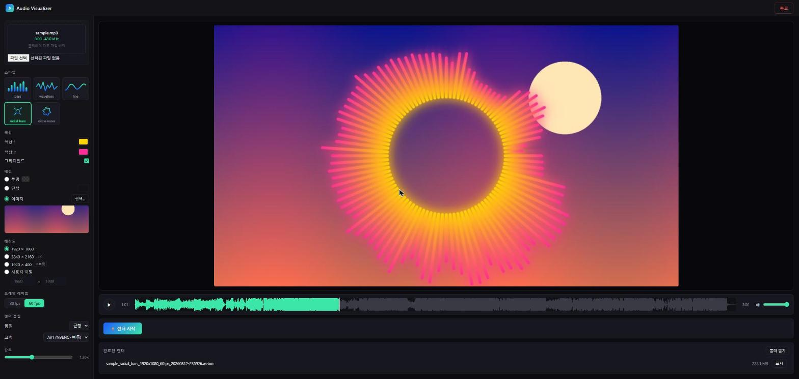

# Audio Visualizer

MP3(및 wav·flac·ogg 등)를 넣으면 **GPU로 렌더링한 비주얼라이저 영상(.webm)** 을 만들어주는 로컬 웹 앱입니다.
미리보기에서 보이는 그대로 내보내집니다(WYSIWYG) — 미리보기와 내보내기가 같은 GPU 렌더러, 같은 설정을 사용합니다.



## 주요 기능

- **스타일 5종**: bars · waveform · line · radial bars · circle wave
- **색상 2개 + 그라디언트**, 감도 조절
- **배경**: 투명(알파 채널 .webm) / 단색 / **이미지 업로드**(GPU 텍스처로 합성, cover-fit)
- 해상도 최대 4K, 30/60fps
- **AV1 NVENC 하드웨어 인코딩**(RTX 40/50) 또는 VP9(호환성)
- 실시간 미리보기(재생·시크바 드래그 중에도 갱신), 설정 자동 저장/복원
- 완료된 렌더 목록에서 바로 열기/탐색기 표시

## 요구 사항

| 항목 | 내용 |
|---|---|
| OS | Windows 10/11 |
| GPU | OpenGL 3.3 지원(최근 10년 내 GPU 대부분). AV1 인코딩은 NVIDIA RTX 40/50 전용 — 다른 GPU는 코덱을 **VP9**로 선택 |
| ffmpeg | 필수. PowerShell에서 한 줄 설치: `winget install Gyan.FFmpeg` |

## 실행 방법

### A. 소스에서 실행 (개발자)

[uv](https://docs.astral.sh/uv/)가 필요합니다.

```powershell
git clone https://github.com/oiehnow/audio-visualizer.git
cd audio-visualizer
uv sync
uv run visualizer        # 브라우저가 자동으로 열립니다
```

또는 `Audio Visualizer 시작.bat` 더블클릭 (처음 실행 시 `uv sync` 자동 수행).

### B. 단독 실행 파일 만들기 (Python 없는 PC 배포용)

```powershell
uv sync
.venv\Scripts\python.exe -m PyInstaller AudioVisualizer.spec
```

`dist\AudioVisualizer\` 폴더가 만들어집니다 — 이 폴더를 통째로 압축해 전달하면
받는 쪽은 **`AudioVisualizer.exe` 더블클릭만으로 실행**됩니다 (ffmpeg 없으면 앱이 설치법을 안내).

앱 종료는 화면 오른쪽 위 **종료** 버튼.

## 결과물 위치

- exe 실행: `내 비디오\Audio Visualizer\`
- 소스 실행: 프로젝트의 `output\`

## 사용법 요약

1. 오디오 파일을 드래그하거나 클릭해 업로드
2. 왼쪽 패널에서 스타일·색상·배경·해상도·프레임레이트·품질을 조절 — 미리보기에 즉시 반영
3. 배경을 **이미지**로 선택하면 원하는 사진을 배경으로 업로드 가능
4. **⚡ 렌더 시작** → 진행률/남은 시간 표시 → 완료 목록에서 다운로드 또는 탐색기 표시
5. 투명 배경을 선택하면 알파 채널이 포함된 VP9 .webm으로 인코딩되어 영상 편집기에 바로 얹을 수 있습니다

## 개발

```powershell
uv run pytest                        # 테스트 139개 (GPU 필요)
uv run python assets/make_icon.py    # 아이콘 재생성
```

### 구조 한 줄 요약

FastAPI 서버(127.0.0.1 전용) + 브라우저 UI. 렌더링은 moderngl(OpenGL, GPU)로,
인코딩은 ffmpeg(NVENC 하드웨어 또는 libvpx)로 수행합니다. 미리보기와 내보내기가
같은 렌더러·같은 설정 매퍼(`settings.build_configs`)를 지나므로 결과가 항상 일치합니다.

```
src/visualizer/
  __main__.py   # CLI 진입점: 포트 스캔, 브라우저 자동 열기
  server.py     # FastAPI: 업로드, 미리보기 WS, 내보내기 잡, 배경 이미지
  settings.py   # RenderSettings -> (분석/렌더/인코딩) 설정 매퍼 (WYSIWYG의 핵심)
  audio.py      # ffmpeg 디코드 -> 48kHz mono PCM
  features.py   # STFT -> 로그 필터뱅크 -> 정규화/스무딩 (프레임별 밴드/파형)
  encode.py     # ffmpeg 인코딩 서브프로세스 (AV1 NVENC / VP9 / VP9+alpha)
  pipeline.py   # draw -> write_frame 락스텝 내보내기 루프
  jobs.py       # 내보내기 잡 상태/진행률
  render/       # moderngl GPU 렌더러 + GLSL 셰이더
frontend/       # 바닐라 JS UI (빌드 스텝 없음)
tests/          # pytest (합성 오디오 픽스처 포함)
```
